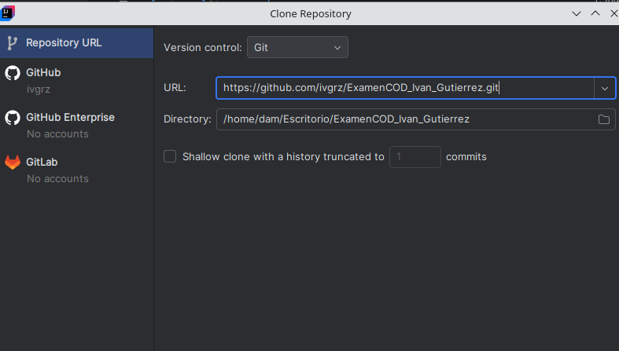
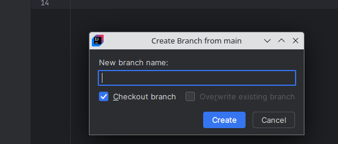
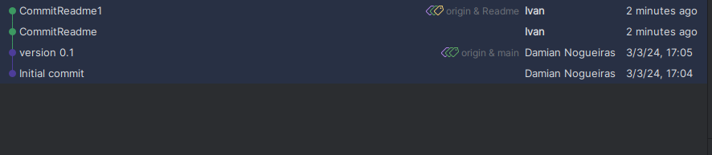
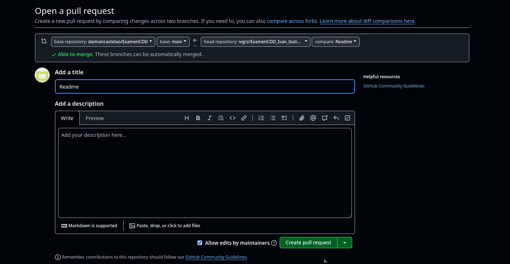

## Instrucciones para realizar examen

# -  Ingresar al repositorio creado por el usuario y realizar un fork

# - Una vez llevado la copia a nuestro propio GitHub, clonamos
este nuevo repositorio en Intellij

# - Creamos tres ramas con distinto nombre para diferenciar la funcion 
de cada una de ellas

# - Realizamos nuestro primer commit en alguna de estas ramas

# - En el github nos aparecera la opcion de realizar el **Pull Request** y el **Merge**

# - Realizamos la misma operacion con las ramas de Datos e Interface

# - Realizamos un ultimo commit con etiqueta de v1.0

